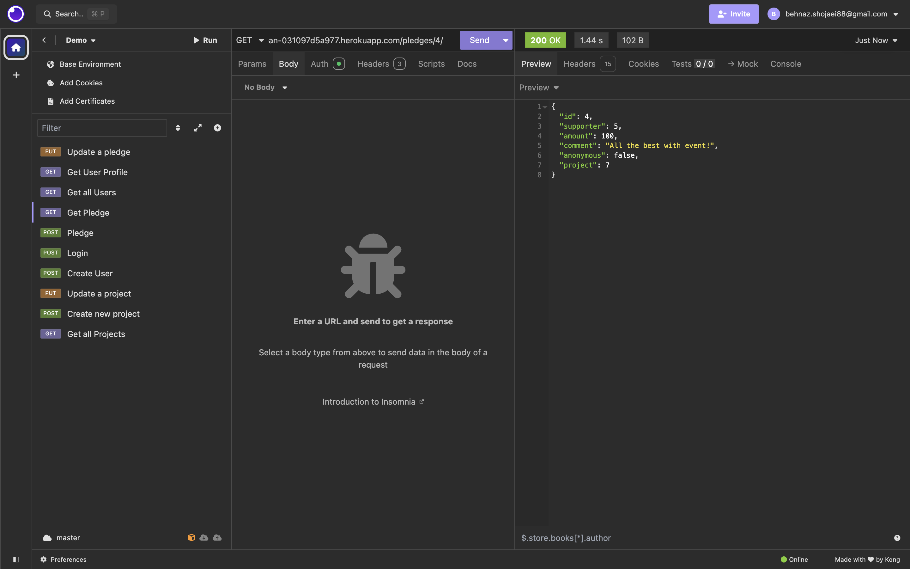
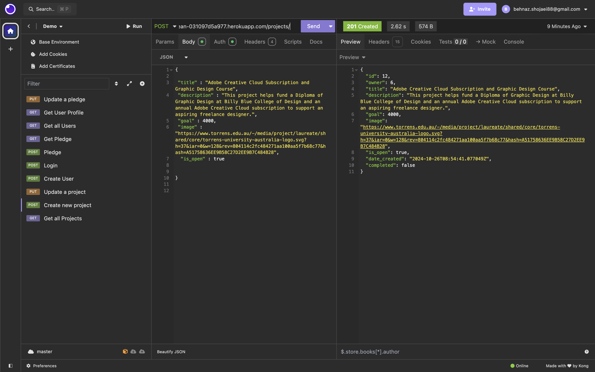

# Crowdfunding Back End
  

## Planning:
### Concept/Name
  Help people to be employable!  / Drops2Ocean  

### Intended Audience/User Stories
  This platform is for anyone seeking support in gaining new skills and advancing their learning and networking journey. We provide assistance in securing premium memberships to online learning platforms like LinkedIn Premium and Udemy, help with attending networking events, preparing resumes, and even getting dressed for interviews! Whether you're looking to upgrade your skillset or make valuable connections, Drops2Ocean is here to support you every step of the way.
 

- [ ] A link to the deployed project.

- [X] A screenshot of Insomnia, demonstrating a successful GET method for any endpoint.
      [screenshots - GET for all endpoints](#get-method-for-all-endpoints)

- [X] A screenshot of Insomnia, demonstrating a successful POST method for any endpoint.
      [screenshots - POST for all endpoints](#post-method-for-all-endpoints)

- [X] A screenshot of Insomnia, demonstrating a token being returned. [See the login token image](#login-token-image)

      
- [ ] Step by step instructions for how to register a new user and create a new project (i.e. endpoints and body data).
- [X] Your refined API specification and Database Schema.

### API Spec
  The table below show the available endpoints and HTTP methods for each. 

| URL                        | HTTP Method | Purpose                               | Request Body  | Success Response Code | Authentication/Authorization               |
|----------------------------|-------------|---------------------------------------|---------------|-----------------------|--------------------------------------------|
| /projects/                | GET         | Returns all projects                  | N/A           | 200                   | N/A                                        |
| /projects/                | POST        | Create a new project                  | Project object| 201                   | Must be logged in                          |
| /projects/<int:pk>/       | GET         | Returns project with ID of <int:pk> | N/A           | 200                   | N/A                                        |
| /projects/<int:pk>/       | PUT         | Updates the project with ID <int:pk> | Project object| 200                   | Must be logged in, must be project owner   |
| /pledges/                 | GET         | Returns all pledges                   | N/A           | 200                   | N/A                                        |
| /pledges/                 | POST        | Create a new pledge                   | Pledge object | 201                   | Must be logged in, must not be the owner of the project |
| /pledges/<int:pk>/        | GET         | Get pledge with ID <int:pk>         | N/A           | 200                   | N/A                                        |
| /pledges/<int:pk>/        | PUT         | Updates the pledge with ID <int:pk> | Pledge object | 200                   | Must be logged in, must be the pledge owner |
| /users/                   | GET         | Returns all users                     | N/A           | 200                   | N/A                                        |
| /users/                   | POST        | Create a new user                     | User object   | 201                   | N/A                                        |
| /users/<int:pk>/          | GET         | Get user with ID <int:pk>           | N/A           | 200                   | Must be logged in, must be the user with ID |
| /profile/                 | GET         | Get the profile of the logged-in user | N/A           | 200                   | Must be logged in, must be the user with ID |
| /api-token-auth/          | POST        | Obtain authentication token           | User credentials | 200                 | N/A                                        |

### DB Schema
You can view the Entity Relationship Diagram [here]( https://viewer.diagrams.net/?tags=%7B%7D&lightbox=1&highlight=0000ff&edit=_blank&layers=1&nav=1&title=ERDcrowdfundingproject#R%3Cmxfile%3E%3Cdiagram%20name%3D%22Page-1%22%20id%3D%22etVU1-LtRZmNaajhlSJn%22%3E7Z1dc9o4FIZ%2FDZftIBsMviwk6X4k007SbbNXGRULUEe2XFkE6K9fyZ%2BAEmJlA3YtzWRaW8iyOeeVHuvYOvTcabj5yGC8vKEBIj2nH2x67kXPcfzhQPwrC7ZZgTcYZQULhoOsCFQFd%2FgXygv7eekKByjZq8gpJRzH%2B4UzGkVoxvfKIGN0vV9tTsn%2BWWO4QErB3QwStfQbDvgyKx07o6r8D4QXy%2BLMwPOzT0JYVM6%2FSbKEAV3vFLmXPXfKKOXZVriZIiJtV9glO%2B7qmU%2FLC2Mo4nUOuPnpr%2F%2BCP78Og9vvdxx8m1x%2BCd4NvayZR0hW%2BTf%2BJ0Esv2K%2BLcwgLj6Wmxx%2Bl0WThEPGc2%2B5fVEg7M8hjsSh7gVI9wmBcYLT6lnJEpPgGm7pihcNFXuTOd6g4DZzlqwr%2FHYtGpO7svG5aPwuvxj5MSR4EYntmfjq8owThhJxLdcw4XmNJQ9JvqnaKTfdI2IcbXaKcrt9RDREnG1Flc2%2BGLeFk%2FP9daUIMM7LljtqcL28EOYqXJRNV44SG7mvdPw2Uvx23Ge3UnqTJWX4l%2FQUyS2768d0f41DAiOhaRgcFE1o2odTf2BCppRQ6eyIRkjxt6wUMBp%2FgWyBeF4QUxzx1BDDifgTppn23w97Q3GtU7EPqn3xJ6szPqVRwpnQlWwDCfeukXTxhNM4b5SgedE%2Byw0vt79Tzmn4rAKO94WXdZELwa2rg5PJYKzI4PPfzwpBWIBjSG7FOAmjBcnclg6bsHLbE7590tqlhQ9Nf9hZqbDnnKQj3xIHARIdd7JeYo7uYjiTldYCHC912eOd4GWH7XjI1XRQ3lhlNe3WIBGjVAS56EKrKEgUr5fX%2BT%2BE4CtC%2BPOiYSEUo3RWd5IId%2BNocZ0d6R0oZdgWpWye79rDN1VOrebOIJ2CURYlL6Ckf0qUeE2jxAP1ZXCe8QMFuGjvtBwpe4DliOc8OR%2BIYIjaTpNW6MM4eozUO1BLj7PTw2%2BaHiP1%2FtMUepQ9wNJjrN5KxjBJ1pQF5tJDQx%2FG0cNzLT2apwdwmsaHNzAWH2UXsPjwhooKUAgxMZcdGuIwjx3qoyvLjvOzY9g4OzQehXWNHfXd1Xl2qHEInDwkqxix1bEH2t1HSH2NmIcQjaiFRcjJEDJuGiEjjUdgXUOIX9tdXUfISH0CNscs4Q%2BGP%2F2orxDjADJSH5dZgJwdIE7t9%2FFOBhCNOGbHAFJ2AQuQkRrFJNB4fmgIxDx%2BqBFPy4%2Fz82PQOD80Ypld48ewtrs6zw81khmIEz78ED0OBQYTpL5EjCPIWOO1TUuQkxFk1DRBxhoz0Y4RpOwCliBjdR6azkAIXeDIXIBoKMQ8gGi8emMBciqAuP3GAaIxFe0aQAa13dV5gKgTUfkYncP53GB81NeHefiwC9HbgI%2FGV6KPNdYBdQ0fdhl6aQr1hRqBDzjj%2BNHgJyAaAjGOH8XKtd0MFoz%2BkKl8jmLkABndz0EzAPldSBFyqj3in2rI923osR76NYaKsjv8PjlofDXyaFAOGt8GH0tTqMFHm4PmVUox7y7ABiHffBapj5LGc9D45sYgfRuDLE2hxiA55sTgCaSGOMxDhw1AtgAdjSeg8c2NP%2Fo2%2FliaQo0%2FBiiZMRxzTKOe45F86I72lOH9XMkszJk%2F3iWZQz5I2zOU%2BqGoILYW%2Bf89x%2FWzLZKVXGXNFhWMZZUNdj5rG1DE4iysmoRV8%2FluQN%2FcbJtVJ7C8An01eLqg0OCMNzrqMJAfNl9aG%2FjReM4b0Dc3YVrVCSw%2FQF%2BNmOJQ%2FqSNwQCxOdOOGMcmTWsDQBrPeAP65mZNqzqBBQjoP5k3jcbI4OVCOgIxECE2aVoLENJ8zpvyV%2FCMRIhNm1bpQI1lpmkLZgyJ%2FwKTOWJTpx2RjRr6tBw5P0caz30DgLnJ06pOYDkCgBrTnNEwJshsiGhIxECI2ARqbYBI4%2BlvAFADm1dNr0I5I0ZsErXKFmpkk64jk38CQEceBiLkid9QJyg48gzNLkBNfVV30C%2BnGCcY9W0ssh7%2BtUaL%2Bj9Y2JY1qOUbfWYuQq36geU%2FcNRwpF2G%2BjqtmHczUPDDAuXt5pOvAErjK1GBY3BQsuwElibAUYOSMBSnez49TUuI0g59GEgQG5FsA0EaX5AKHHN%2F06HqBJYgwFHjkTMahshshNiI5BHjaKxltwg5GUJasEzU0Yhvdo4h9R3WeYYU59ydhQj3bcVMJDGZIvUlYh5FXJuesxUUaX6xqKsR1OwaRdz6zzm7TxE1ppmsYtmJjH47QkMiBlLEpldrBUWaXzHqqrNSg96wc22StcoW6qy05MiDONRglNjkZ88bZ6BOYi1Kzo%2BSFqwcHahTU4NQUvYDixIwUKemcfbzL2aDREMjXQbJ8sfFp%2B1sGs%2Fvvoa3Hrz%2FFPCrdzXiWvL17eJ1OmFpzLe3iECZA%2Fay%2BiR76S7jCHD2%2FYSi4ANjqWsvb4V4vtAbGG2lQOTXQgVnRNtse7%2B786%2FceT8sdi82ux9eFDBCG8zvi1OJ7Z2jxF51kNwpjsm%2BZPpieiWHJ9%2FpTuiKzdAReQ3z2xReoO6FG5qjA1OZsW9XFmUhS%2B3%2BuH%2FNR7T3WQK3UrVTaC6H18A50Fv2XfOjKq0pDbkHDbmHDWW2UBp6K9HWCMG1XbT1BfiyrrIVKc3pCvj7cgDeK3U18PYbKl88OZOuarymeHZdgd9qMPRrizaDcnOi9fr7WmufZsUuozJTelVd3AItb2iAZI3%2FAA%3D%3D%3C%2Fdiagram%3E%3C%2Fmxfile%3E )

### GET method for all endpoints
GET all projects:

GET project by id:

GET all pledges:

GET pledge by id:

GET all users

GET user by id:

GET user profile:

### POST method for all endpoints

Create project, POST to projects endpoint:

Create user, POST to users endpoint:

Make a pledge, POST to pledges endpoint:

Login, POST to api-token-auth endpoint:

