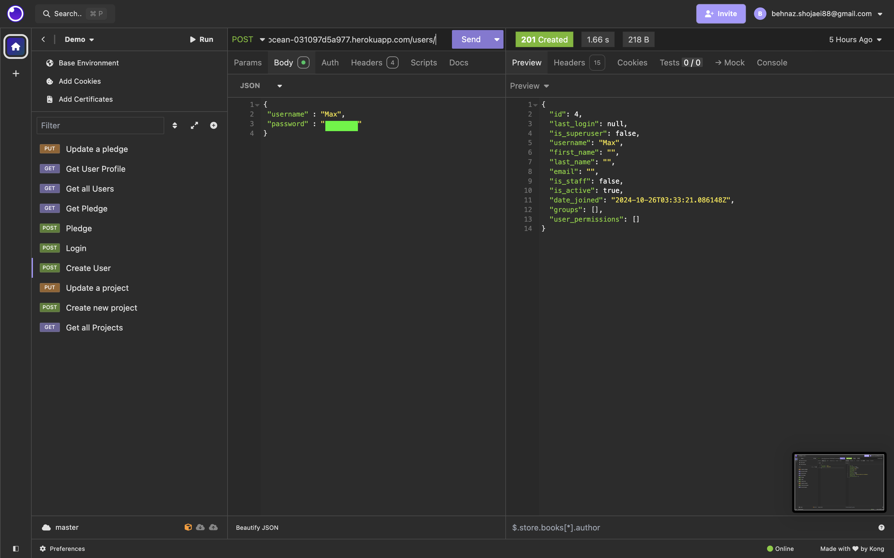
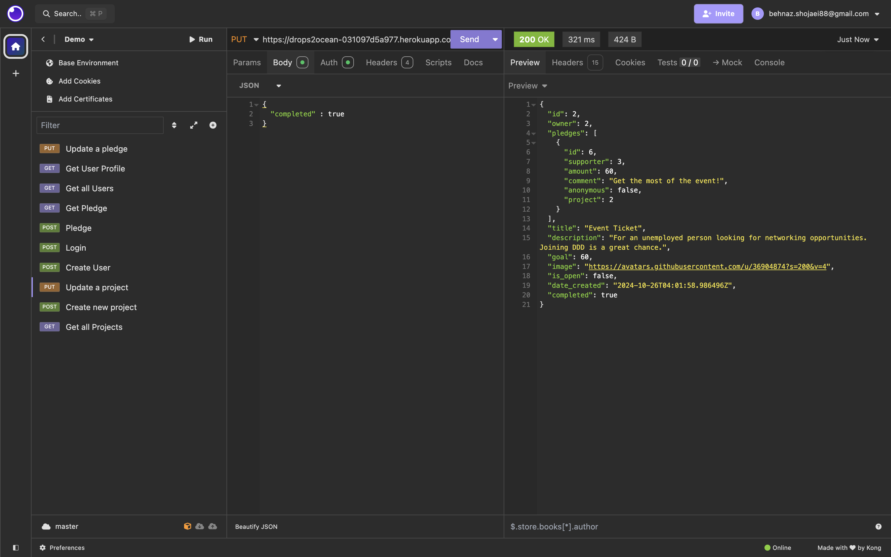

# Crowdfunding Back End with Django Rest Framework Project:

## Planning:
### Name: 
Drops2Ocean
### Concept:
  Help people to be employable!  

### Intended Audience/User Stories
  This platform is for anyone seeking support in gaining new skills and advancing their learning and networking journey. We provide assistance in securing premium memberships to online learning platforms like LinkedIn Premium and Udemy, help with attending networking events, preparing resumes, and even getting dressed for interviews! Whether you're looking to upgrade your skillset or make valuable connections, Drops2Ocean is here to support you every step of the way.
 
<a name="checklist"></a>

### Check List:

- [X] A link to the deployed project. [Drops2Ocean API on heroku](https://drops2ocean-031097d5a977.herokuapp.com/projects/)

- [X] A screenshot of Insomnia, demonstrating a successful GET method for any endpoint.
      [screenshots - GET for all endpoints](#get-method-for-all-endpoints)

- [X] A screenshot of Insomnia, demonstrating a successful POST method for any endpoint.
      [screenshots - POST for all endpoints](#post-method-for-all-endpoints)

- [X] A screenshot of Insomnia, demonstrating a successful PUT method for any endpoint.
      [screenshots - PUT for available endpoints](#put-method-for-available-endpoints)


- [X] A screenshot of Insomnia, demonstrating a token being returned. [See the login token image](#login-token-image)

      
- [X] Step by step instructions for how to register a new user and create a new project (i.e. endpoints and body data). [See the instructions here](#step-by-step-instructions)

- [X] Apply complex logic. [See details and images](#complex-logic)

- [X] Your refined API specification and Database Schema.


### API Spec
  The table below show the available endpoints and HTTP methods for each. 


| URL                        | HTTP Method | Purpose                               | Request Body  | Success Response Code | Authentication/Authorization               |
|----------------------------|-------------|---------------------------------------|---------------|-----------------------|--------------------------------------------|
| /projects/                | GET         | Returns all projects                  | N/A           | 200                   | N/A                                        |
| /projects/                | POST        | Create a new project                  | Project object| 201                   | Must be logged in, token required          |
| /projects/<int:pk>/       | GET         | Returns project with ID of <int:pk> | N/A           | 200                   | N/A                                        |
| /projects/<int:pk>/       | PUT         | Updates the project with ID <int:pk> | Project object| 200                   | Must be logged in, must be project owner   |
| /pledges/                 | GET         | Returns all pledges                   | N/A           | 200                   | N/A                                        |
| /pledges/                 | POST        | Create a new pledge                   | Pledge object | 201                   | Must be logged in, must not be the owner of the project |
| /pledges/<int:pk>/        | GET         | Get pledge with ID <int:pk>         | N/A           | 200                   | N/A                                        |
| /pledges/<int:pk>/        | PUT         | Updates the pledge with ID <int:pk> | Pledge object | 200                   | Must be logged in, must be the pledge owner |
| /users/                   | GET         | Returns all users                     | N/A           | 200                   | N/A                                        |
| /users/                   | POST        | Create a new user                     | User object   | 201                   | N/A                                        |
| /users/<int:pk>/          | GET         | Get user with ID <int:pk>           | N/A           | 200                   | Must be logged in, must be the user with ID |
| /profile/                 | GET         | Get the profile of the logged-in user | N/A           | 200                   | Must be logged in, must be the user with ID |
| /api-token-auth/          | POST        | Obtain authentication token           | User credentials | 200                 | N/A                                        |


### DB Schema
You can view the Entity Relationship Diagram [here](screenshots/ERD-drops2ocean.jpg) and [ERD for the project here](crowdfunding/ERDcrowdfunding.png)

[Back to checklist](#checklist)
### GET method for all endpoints

<a name="get-all-projects-image"></a>
GET all projects:


GET project by id:


GET all pledges:


GET pledge by id:


GET all users


GET user by id:


GET user profile:


[Back to checklist](#checklist)
### POST method for all endpoints

<a name="create-project-image"></a>
Create project, POST to projects endpoint:


<a name="create-user-image"></a>
Create user, POST to users endpoint:


Make a pledge, POST to pledges endpoint:


Login, POST to api-token-auth endpoint:
<a name="login-token-image"></a>


[Back to checklist](#checklist)
<a name="step-by-step-instructions"></a>
### PUT method for available endpoints

Update a project by owner, PUT to project by id endpoint:



Update a pledge by non-supporter, PUT to pledge by id endpoint:


Update a pledge by supporter, PUT to pledge by id endpoint:


[Back to checklist](#checklist)
<a name="step-by-step-instructions"></a>

### Step by Step Instructions to Create a New Project: 

#### 1. **Register a New User**

- **Description:** This endpoint registers a new user. You need to provide a unique `username`, a valid `email`, and a `password`.
- **Endpoint:** `POST /users/`
- **Body Data:**
    
    ```
    {
      "username": "new_user",
      "email": "new_user@example.com",
      "password": "secure_password123"
    }
    
    ```
    
- **Success Response:** `201 Created`
[See the create user image](#create-user-image)

#### 2. **Log in and Obtain Token**

- **Description:** This step logs in the user and returns an authentication token. You will use this token in the header for authenticated requests.
- **Endpoint:** `POST /api-token-auth/`
- **Body Data:**
    
    ```
    {
      "username": "new_user",
      "password": "secure_password123"
    }
    
    ```
    
- **Success Response:** `200 OK`
[See the login token image](#login-token-image)


#### 3. **Create a New Project**

- **Description:** This endpoint creates a new project. The project requires a `title`, `description`, `goal` (e.g., in dollars), and a boolean `is_open` field to indicate if the project is accepting pledges.
- **Endpoint:** `POST /projects/`
- **AUTH/bearer token**
    
    ```
    TOKEN:  Paste_your_auth_token_here
    PREFIX: token

    
    ```
    
- **Body Data:**
    
```
    {
    "title" : "Interview Dress",
    "description" : "Pass",
    "goal" : 200,
    "image" : "https://www.logo.wine/a/logo/Udemy/Udemy-Logo.wine.svg",
	"is_open" : true
    }
```
    
- **Success Response:** `201 Created` 
[See the create project image](#create-project-image)


#### 4. **Get All Projects**

- **Description:** This endpoint retrieves all projects, optionally including authorization if necessary.
- **Endpoint:** `GET /projects/`    
- **Success Response:** `200 OK`
[See the get all projects image](#get-all-projects-image)

[Back to checklist](#checklist)

### Complex logic

To check if a project reached its goal, the logic has been added to views project app. The logic check if the final pledge is not exceeding the remaining amount to the project goal and prompt user with the remaining amount if it is the case. Also the logic would not accept new pledges for a project that already met the goal and is closed.

Test goal met/ project closed:


Test goal exceed:


[Back to checklist](#checklist)